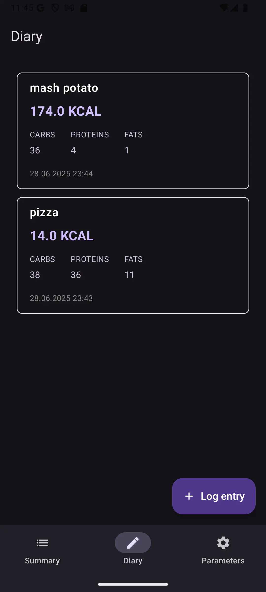

# Calories Diary

A modern Android application for tracking daily calorie intake and macronutrients, built with Jetpack Compose and following clean architecture principles.

<p align="center">
  
  
  
  
</p>

## 🎯 Features

- **Daily Nutrition Summary** - Track calories, proteins, carbs, and fats with visual progress indicators
- **Food Diary** - Log meals with detailed nutritional information
- **Smart Calculations** - Personalized nutrition targets based on BMR (Basal Metabolic Rate)
- **User Parameters** - Set your height, weight, and age for accurate calculations
- **Material You Design** - Modern dark theme following Material Design 3 guidelines
- **Offline First** - All data stored locally with Proto DataStore
- **Figma Limitations** - Not all icons from Figma are available, not all theme colors are known

## 🏗 Architecture

This project follows **Clean Architecture** principles with a modular approach:

```
CaloriesDiary/
├── app/                    # Main application module
├── build-logic/           # Convention plugins for consistent module configuration
├── core/                  # Core modules with shared functionality
│   ├── data/             # Data layer with repositories
│   ├── datastore-proto/  # Proto DataStore schemas
│   ├── designsystem/     # Design tokens and UI components
│   ├── model/            # Domain models
│   └── ui/               # Shared UI utilities
├── feature/              # Feature modules
│   ├── diary/           # Food diary screen
│   ├── newmeal/         # Add new meal screen
│   ├── parameters/      # User parameters screen
│   └── summary/         # Daily summary screen
└── libs/                # Custom libraries
    └── paging/          # Custom paging implementation
```

### Key Technologies

- **UI**: Jetpack Compose with Material 3
- **Architecture**: MVI pattern with [MVIKotlin](https://github.com/arkivanov/MVIKotlin)
- **DI**: Hilt
- **Navigation**: Compose Navigation
- **Data Persistence**: Proto DataStore
- **Build**: Gradle with Convention Plugins

## 🚀 Getting Started

### Prerequisites

- Android Studio Hedgehog (2023.1.1) or newer
- JDK 17
- Android SDK with minimum API 24

### Building the Project

1. Clone the repository:
```bash
git clone https://github.com/yourusername/CaloriesDiary.git
```

2. Open the project in Android Studio

3. Sync project with Gradle files

4. Run the app on an emulator or physical device

## 📱 Features Overview

### Summary Screen
Displays daily nutrition progress with circular indicators for:
- Total calorie intake
- Macronutrient breakdown (carbs, fats, proteins)
- Personalized targets based on user parameters

### Diary Screen
- List of consumed meals with nutritional information
- Infinite scrolling with custom paging
- Empty state for new users
- Floating action button to add new entries

### New Entry Screen
- Input fields for meal name and nutritional values
- Input validation and limits
- Accessible numeric input with proper keyboard types

### Parameters Screen
- User profile settings (height, weight, age)
- Auto-save with debouncing
- Input validation and limits

## 🏛 Architecture Details

### MVI Pattern with MVIKotlin
Each feature follows the MVI (Model-View-Intent) pattern:
- **Store**: Manages state and business logic
- **View**: Composable functions that render UI
- **Intent**: User actions and system events

### Modularization Strategy
- **Feature modules**: Self-contained features with their own navigation
- **Core modules**: Shared functionality and utilities
- **Convention plugins**: Consistent module configuration

### Data Flow
```
User Action → Intent → Store → Reducer → State → UI
                ↓
            Executor
                ↓
         Side Effects
```

## 🧪 Testing

The project includes:
- Unit tests for business logic
- Integration tests for data layer
- UI tests with Compose testing framework

Run tests:
```bash
./gradlew test
```

## 📚 Module Documentation

- [Build Logic](build-logic/README.md) - Gradle convention plugins
- [Design System](core/designsystem/README.md) - UI components and theming
- [Custom Paging](libs/paging/README.md) - Lightweight paging solution
- [Feature Modules](feature/) - Individual feature documentation

## 🚧 Roadmap & Improvements

The following improvements are planned for future releases:

- **Complete Test Coverage**
  - Add unit tests for all ViewModels and Stores
  - Integration tests for repositories
  - End-to-end tests for critical user flows

- **Screenshot Testing**
  - Implement screenshot tests using Paparazzi or similar tools
  - Ensure UI consistency across different screen sizes
  - Automated visual regression testing

- **CI/CD Pipeline**
  - Set up GitHub Actions for automated builds
  - Run tests on every pull request
  - Automated release builds and deployment

- **Pixel Perfect Design**
  - Fine-tune UI elements to match design specifications exactly
  - Implement proper spacing, typography, and color systems
  - Add micro-animations and transitions

- **Backend Synchronization**
  - Add cloud sync functionality for user data
  - Implement authentication and user accounts
  - Enable cross-device synchronization
  - Backup and restore functionality

## 🙏 Acknowledgments

- Design inspired by modern health and fitness applications
- Built with best practices from [Now in Android](https://github.com/android/nowinandroid)
- MVI pattern implementation using [MVIKotlin](https://github.com/arkivanov/MVIKotlin)